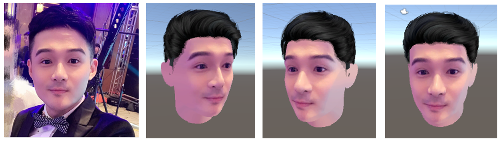

Create 3D avatar from single photo (Shown in Fiureg.1). My major concern was on the hair part since it’s not well solved in most of the state-of-the-art applications. The 3D face mesh was generated from 3D morphable face model.

---

>  Column[1]: Input photo. Columns[2,3,4]: Output 3D model from different view

---

In this project, I transferred ResNet into a hairstyle classifier and trained it with my own database. This classifier helps match the hairstyle in photo with one of the models in my 3D hair repository. Since the location, scale and rotation of the 3D face mesh depends on the input picture, alignment is needed between the selected hair model and the generated face. By fitting the landmarks of the face mesh and the standard head, the transformation matrix of hair model can be obtained. After that, to generate a face texture, landmarks and face segmentation mask were used to define ROI on the input photo (including face features while excluding background and occlusions). The entire texture can be obtained by extending the ROI from its’ edge in radial directions, and then applied onto the face mesh.

-------

- Some results of my hairstyle classifier (extract code if required: niyt ) :
https://pan.baidu.com/s/1S1yPM8gfEKhO5u51fNOjmQ 

- My code for face/hair segmentation (SemSeg) and hairstyle classification (classifier/resnet18/): https://github.com/KayTsao/hairstyleMatching

